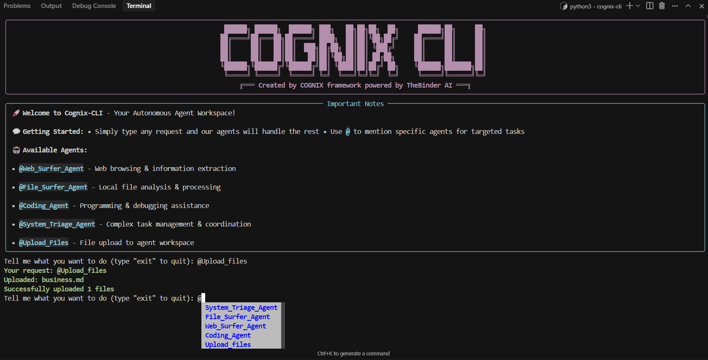

# Cognix CLI

<div align="center">
  <h2>
    TheBinder AI Agent Core CLI for Deep Research
  </h2>

  <div align="center"> 
    <a href="https://github.com/TheBinder-AI/cognix-cli/stargazers">
    
  </a>
    <a href="https://github.com/TheBinder-AI/cognix-cli/graphs/commit-activity"></a>
    <a href="https://github.com/TheBinder-AI/cognix-cli/issues"></a>
    <a href="https://github.com/TheBinder-AI/cognix-cli/blob/main/LICENSE"></a>
  </div>
</div>

<p align="center">
  
</p>

Welcome to **Cognix CLI**, a powerful CLI for AI-powered agents designed for deep research and intelligent task automation.

## Overview

```bash
WIP
```

## Key Features

- **AI Agent Management**: Create, configure, and manage AI agents with specialized research capabilities
- **Deep Research Tools**: Advanced tools for information gathering, analysis, and synthesis
- **Memory System**: Persistent memory for long-term research projects and context retention
- **Workflow Orchestration**: Define and execute complex research workflows
- **Multi-Provider Support**: Integration with various AI providers (OpenAI, Anthropic, etc.)
- **Extensible Architecture**: Plugin system for custom tools and workflows
- **CLI Interface**: Powerful command-line interface for seamless research automation

## Installation

### Prerequisites

- Python 3.10 or higher

### Install via pip

```bash
pip install cognix-cli
```

### Install from source

```bash
git clone https://github.com/TheBinder-AI/cognix-cli.git
cd cognix-cli
pip install -e .
```

## Quick Start

### Basic Usage


```bash
WIP
```


## Configuration

### Environment Variables

Create a `.env` file or set the following environment variables:

```bash
WIP
```


## Contributing

We welcome contributions from the community! Please see our [Contributing Guide](CONTRIBUTING.md) for details on how to get started.

### Development Guidelines

1. **Code Style**: Follow PEP 8 and use type hints
2. **Testing**: Write tests for new features
3. **Documentation**: Update documentation for new functionality
4. **Pull Requests**: Create detailed pull request descriptions

## License

Cognix CLI is licensed under the [Apache License 2.0](LICENSE). See the LICENSE file for details.

## Support

- **GitHub Issues**: [Report bugs and request features](https://github.com/TheBinder-AI/cognix-cli/issues)

## Roadmap

- [ ] Enhanced memory system with long-term storage
- [ ] GUI interface for non-technical users
- [ ] Integration with more AI providers
- [ ] Advanced workflow templates
- [ ] Real-time collaboration features
- [ ] Cloud deployment options
- [ ] MCP Tools
- [ ] Evals and Tracing analytics

## Acknowledgments

This project was created by **Jahid Hasan** and the **TheBinder AI** team. Special thanks to the open-source community and all contributors who have helped improve Cognix CLI.

## Contact

- **GitHub**: [TheBinder-AI/cognix-cli](https://github.com/TheBinder-AI/cognix-cli)
- **X (Twitter)**: [@TheBinderAI](https://x.com/TheBinderAI)

---

*Built with ❤️ by TheBinder AI for the research community*
